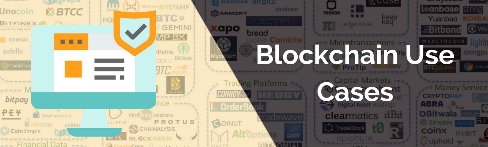

# Blockchain Use Cases

Blockchain technology has come a long way since it's first inception as the global peer to peer payments ledger of Bitcoin. So much so, that most of the information online about the use cases for blockchain are polarized between grand visionary futures of an interconnected internet of value and warnings of financial doom resembling the financial bubbles of the past.  
  
Chances are however, If you’re dealing with a business process that is cumbersome, complicated, full of paper trails, is high in administrative labor, and poses a significant risk to security and profitability, then blockchain solutions should be on your radar.

Since there is a polarizing and scattered ecosystem in the marketplace, what we will be doing is laying out the strengths and pitfalls of blockchain technology based on irrefutable facts, and then determining the feasibility and most appropriate uses for a blockchain based on those facts.  
  
Let's get started!


### Main issues with blockchains

1. Data storage and transfer is minimal
2. Human error can cause dire and irreversible circumstances
3. Accounts and transactions are not very user friendly


### Issue 1: Data storage and transfers

As we learned in the Intro to Blockchain, these ledgers are immutable, meaning the data cannot be modified, deleted, or moved elsewhere. The problem this adds is with the peer-to-peer nature of blockchain systems. If each and every participant maintains a full working copy of the blockchain, then every time any data is added to it, it must be added to the hard drives of all participants in the network.

#### Example:

> You are the owner of a modest media and design firm that focuses on technology based clients. You have heard a lot about blockchain from these clients, and have become interested yourself at the possibilities. After reading about the benefits and how they work, you decide you could use one within your own business to streamline the access and copyright protection of images created in house. You envision:
>
> * A secure master file for all company IP
> * Irrefutable transaction signatures to secure copyrighted content
> * Elimination of cloud storage providers by leveraging your employees empty hard drive space to store your images on the shared blockchain.
>
> At first glance, you see blockchain as a great way to create a secure master file of all company images and avoid the hosting costs of cloud storage providers. Now blockchain enables everyone to share their files and encrypt them in real time.
>
> At first, it's amazing. The IT department setup a notification system the let's employees know when images were added from specific departments, which helps employees save time that they would otherwise use checking the company. They also setup an application that automatically forwards images to be submitted for copyright protection.  
>   
> So each time one of your designers, photographers, or editors creates an image it get's automatically added to the blockchain. And when an employee needs an image, they simply use whatever naming convention you came up with to retrieve them. Life is good.  
>   
> As time progresses however, everyone's systems start moving extremely slow, and eventually the network becomes unusable. There is simply too much bandwidth moving from employee to employee for anybody to use the internet. You clients however are amazed by your innovative firm, and love being able to retrieve their images anytime from the app using their unique signatures. So you buckle down and pay for more bandwidth.  
>   
> Fast forward and it's been a year. Your internet costs are astronomically higher than the costs of cloud storage, and everyone is out of hard drive space.  You are forced to move all images back to a cloud storage provider and have lost many employees and clients due to the frustratingly slow experience. Your idea failed, your app failed, and your company is worse off than it was before.

#### What went wrong?

Let's say the average image was 2 MB in file size, which is double the current maximum size of an entire Bitcoin block, which houses upwards of 1250 transactions as of this writing. \[3\]

Now as we covered previously, Bitcoin is not blockchain, so the amount of data you can put in each block to be written to a blockchain is entirely up to you. So lets say the blockchain was designed to have block sizes of 2GB.

As you can probably surmise, if there were 1000 participants all sharing even a single 2MB image each day for an entire year, they would all have a blockchain taking up 730 GB of data storage on their machines, or a combined total of 730 Terrabytes for the company as a whole. The block height would be 365,000 for those also following along with the chain of things.  
  
What a colossal waste of bandwidth and storage space. So as you can see, blockchains are not good for storing or transferring rich data. 


### How could this be solved?

Since storing data directly to a blockchain is a bad idea, we have to think deeper into the systems to achieve the same results. There are actually multiple working Blockchain solutions designed just to store data. 

The most common of which are StorJ and IPFS. These networks borrow some key properties of cryptography from blockchain ledgers and use them to build retrieval systems that provide the security of the blockchain without storing files directly to one.

Instead, these systems break apart your files and distribute them across specialized nodes that store files economically. These nodes send back unique signatures that identify your files on the network. 

It is these unique signatures that you would store to a blockchain, and anytime you needed to retrieve a file, you simply request your signature from the blockchain and then submit that to the storage system which unlocks and retrieves your files for you.

**In simple terms, you would just take the signature of image to store, not the image itself.**


### Issue 2: Human error breeds catastrophe

This is possibly one of the most glossed over attributes of blockchain systems in the industry. While we can all imagine the benefits of automated contracts, distributed value systems, and individual digital ownership of assets, we should all be equally as concerned about them. For example:

* If you make a transaction to the wrong address, that asset transfer is unrecoverable. 
* If you deploy a smart contract with an exploit in the programming, the software can't just be updated to fix it.
* If you don't maintain secure and accessible environments for your access keys, you can be locked out your accounts forever.
* If the consensus model isn't secure for your distributed network, an attacker can seize control of the entire blockchain.

As you can see, these are some serious drawbacks to using a blockchain system.

I've had the displeasure of informing clients from high level fund managers to your average consumer that there isn't any third party that can come to their rescue after mismanaging their assets. This is last thing anybody wants to hear after losing any sum of money.


###  Common Human Errors in Blockchain

* Using an Incorrect Recipient Address
* Falling for Phishing Attacks
* Programming Vulnerable Smart Contracts
* Designing Vulnerable Consensus Networks
* Sending Assets to Incompatible Wallets
* Ignoring the Advice of Experts and the Failures of Yesterday
* Using Blockchains for Incompatible Use Cases
* Assuming Blockchain Systems can be Compatible
* Not Securing Account Information and Keys Sufficiently


#### Case Study: The DAO Hack

> "The DAO" was the name of a specific Distributed Autonomous Organization, which launched on the Ethereum platform April 30th, 2016.  They were building a venture capital platform where investment decisions would be made based on community consensus rather than a centralized panel of executives.

> The DAO was represented everything innovative and comforting about public crowd sales, and promised to build a decentralized organization that would allow democratic management of both commercial and non-profit enterprises. At the time, The DAO was the largest crowdfunding in history, with over $150 million in capital raised in just 28 days.
>
> The creators of The DAO were not expecting such an overwhelming interest, and were not prepared to handle it. They did not cap their funding round, which is a standard ethic regarding the raising of capital.

> Once the crowdsale was over, many issues were addressed regarding potential vulnerabilities and exploits of the smart contracts managing the organization. After all, this was the most complicated attempt at such an organization to date. One such exploit that was discussed, was the "recursive call bug", which had been found in the software by one of the founders.
>
> Despite the vulnerability, the founders insisted that it was patched before launching and that DAO funds were not at any risk of being exploited.
>
> In June 2016, users exploited the vulnerability which enabled them to steal 3.6 million ether, worth around $80 million at the time, of The DAO's funds. In July 2016 at Block 1,920,000 on the Ethereum blockchain, the Ethereum development community voted to hard-fork the Ethereum blockchain to restore virtually all funds that were stolen to the original accounts.
>
> This was highly controversial and led to a lasting fork in Ethereum. This is why there is an Ethereum Classic \(Original Chain\) and an Ethereum \(Developer Approved Chain\).

> The DAO was completely delisted from all exchanges and the project was pronounced dead in the water in just a few months time.

Now it's important to simplify what happened here so you can understand the gravity of what can happen in blockchain systems: 

* A successfully funded startup raised over 100 million dollars and lost it all due to just a **few lines of code** in their smart contracts.
* The founders ignored the advice and recommendations of legal and technical experts all over the world and decided to push forward on a project prematurely.
* The SEC concluded that DAO tokens sold on the Ethereum blockchain were securities and therefore possible violations of U.S. securities laws.
* Ethereum was forced to bail the DAO and their investors out at their own expense by initiating a hard fork that returned stolen funds back to the original accounts.


### How could the DAO hack have been prevented?

You have to expect security flaws to show up in any IT system, period. There isn't a developer alive who doesn't leave a vulnerability in their program, and not because they aren't experienced enough, but because human ingenuity always finds a new attack vector to exploit.

In the DAO's case, they simply rushed their technology and ignored the warning signs of significant vulnerabilities.

Good news is, there are pretty standard practices to follow to help bolster the efficiency and security of your blockchain system:

1. Smart Contract Audits
2. Network Stress Testing
3. Multiple Product Phases Prior to Launch
4. Formal Security Audits
5. Bug Bounties
6. Did I say test? Keep testing
7. Consult with expert advisers in every piece of your use case

If the DAO had simply slowed down, broken their product launch into lengthy test phases, performed professional audits, and heeded the warnings of their advisers, then the hack likely would have never occurred.


The scope of human error extends into the most catastrophic circumstances in blockchain systems. Unlike traditional centralized systems, there are no third parties to rely on for support, and there isn't a quick way to patch or reverse exploits once they are found. Furthermore, if you are operating on a public network without KYC, there may not even be an avenue for legal support. 

Blockchain is still new technology, and isn't a full stack system, so don't rush into it without expecting copious amounts of trial and error. Next, we will talking about the last main issue, poor user experience, which unfortunately acts as a multiplier on the problem of human error.

### Issue 3:  User experience is uncompromising and technical

Conflicting terminology, punishing interfaces, gibberish addresses, memorizing password seeds, writing down private keys, and error message after error message. You would think i'm describing the early internet here, but unfortunately this is the current state of the blockchain experience. It's hard to attract users and administrators to a platform that requires a heap of learning and time to accomplish anything on.

Unless of course those users get a sense of superiority out of being a wizard at the clunky systems nobody wants anything to do with.

Now I may be being cynical with this point, but the reality of today is that the user is king. The business model of today is centralized around monetizing the actions of people online, and the data trails they leave behind. 

I want to be clear before really diving in, that I am not referring to the user interface \(UI\) in blockchain systems. This can be controlled quite easily and there are many blockchain companies with some of the most appealing and intuitive user interfaces around. There's a reason for that however, and that reason is that blockchain systems have to compromise for the actual user experience being uncompromising and technical.

Take a simple decentralized application, or Dapp, built on Ethereum as an example:


### The Dapp "New User Experience"

Let's imagine that you were trying to learn more about decentralized applications, which are applications that run autonomously on distributed networks without a central authority. 

You found a particular Dapp that provides a decentralized news network, and are curious for how it works. You go to setup an account on their website, but you are quickly prompted with a message that you need to install some software. In this case, it's the Chrome browser extension Metamask, which acts as an account bridge between traditional browsers and the Ethereum blockchain.

Once installed, you are able to create your account, but as you go to pay for a membership, you realize that your Metamask wallet is empty. You then navigate to Coinbase to get some Ether, which requires you to go get your phone from the other room for the two factor authentication required to login into your account.

Once logged in, you buy some Ether, and send it to the Metamask address your created. By the time you have done all of this, it's been 15 minutes and you have become disinterested in the Dapp and more interested in the current price trends of cryptocurrency.

You forget all about the Dapp and spend the next couple hours learning about cryptocurrencies and wallets.


Contrast this experience to Netflix. You sign up for an account, input your credit card information, and bam you have access to a massive library of entertainment. This is made possible largely due to the centralization of services and technology. 

There are a whole list of new expectations placed on a user of blockchain systems that can cause difficuties ranging from compromising accounts to wasting a lot of time putting the pieces together to use the system effectively. 


### Blockchain Users Are Expected To

* Piece together software for feature accessibility
* Manage financial accounts
* Implement access control measures
* Understand technical jargon


I mean take the definiton of a blockchain from chapter one

> A blockchain is a chronologically sorted, distributed, digital ledger which contains an irreversible archive of transaction records that are stored and chained together in batches called blocks.

Do we expect the public to actually memorize this? Do we want our users to even think about blockchain? I would propose that in most cases we do not.

A product's focus should always be on the user and how their needs, desires, and interests are amplified and supported by what we build. You don't see companies talking about how amazing and innovative the Windows registry is towards the security and management of their operating system experience.

The technology isn't important to the user, the experience is. 

#### So f**or the blockchain user experience to improve we need to accomplish two things:**

1. Effectively communicate the benefits of blockchain technology without requiring anybody to have any clue what it is.
2. Advance the technology stack of blockchain so that the burden of abstracting the technical understandings of it is easier to do in the first place.

#### Why is this the correct path to take?

Well, we often take the UX for granted on the internet these days, and behind these wonderful experiences are decades of innovations and efficiencies built into everything from the hardware being used to the communications protocols active on the network.

Let's take something as simple as email as an example of a user experience improving over time:

> When email first became popular back in the 1980s, there were two communications protocols developed to facilitated access to email over a remote server. They were POP \(Post Office Protocol\) and IMAP \(Internet Message access protocol\).
>
> POP only downloads email to a device, and will typically delete the email from the server it was retrieved from. This protocol isn't very user friendly, as it doesn't synchronize the retrieval of your email across all of your devices, requiring you to read and delete the same emails on every single account. Furthermore, any settings set on one device for email, won't be synchronized across devices either.

> IMAP was the solution to this user experience, which allows you to store your email on remote servers. This feature allowed accounts on servers to manage the state of your email experience across all devices, which when considering the average person owns 3 devices, this is a massive improvement.
>
> So instead of downloading your emails, you are simply viewing them on a server owned by you or a provider like Google or Microsoft.

The point being made here is that Blockchain simply hasn't had the time, nor experience to mature into a more user friendly technology, but like email, these are likely temporary issues and as developers continue to flock towards emerging technologies like blockchain the experience will only become smoother and more flexible for all. 

We shouldn't make blockchain the focus of our user experience, because it requires significant technical burden to bear that your average user likely won't have the time, interest, or patience to adhere to resulting in many of the catastrophic human errors talked about earlier.

Now that we have gone over the main issues with blockchain technology, which are data limitations, high human risk, and poor user experiences, it's time to move on to the main benefits of blockchain technology!


### Main benefits of blockchains

1. Information is transparent and auditable by all participants
2. Transactions are cheaper, faster, and more efficient than traditional 3rd party mediation systems
3. Transactions are immutable, maintain their integrity over time, and require agreement from all participants to be valid


### Benefit 1: Distributed Trust

At face value the idea of having distributed trust, especially concerning information representing an ownership of value, is often met with skepticism. When thinking from a business perspective, how could sharing more information with your business network be more secure and trustworthy than the alternative? It practically undermines most security controls we currently use, which aim to limit as much access to information as possible.

Why not just stick with your private cloud system where all of your records and transactions are stored and managed where you can control the outcome? 

Why not just keep that 3rd party intermediary to manage the trustful transference of sensitive data?

The reason why we are initially skeptical about distributed trust, is simply because we haven't had the ability to actually achieve it before now in an efficient way. Our main concern with transactions is ensuring that both parties agree and also fulfill it as agreed upon without any additional modifications, erroneous actions, or corrupt behavior.

> Think about the classic movie scene where two opposing gangs meet in a location with briefcases in hand. These briefcases contain something of value to exchange. It could be information, it could be cash, it could be microprocessors, it doesn't matter. 
>
> The exchange of value needs to be verified, so both parties reveal what's inside their briefcases to reassure to the other party that they intend to exchange what was agreed upon. Once verified, they make the trade and hopefully part ways without conflict.
>
> Unfortunately, without a third party mediating the exchange, either side could end up being overtaken by force and have their funds stolen, they could accept fraudulent items in the exchange, or simply by mistake transfer the incorrect amount.
>
> Cue the shootouts, car chases, and fall of an organization.

Now obviously making a PayPal transaction isn't synonymous with a crime dealing in an abandoned airfield, but at its foundation its not _**THAT**_ different. With most transactions today there are four main risks that are taken on.

1. Fraud
2. Chargebacks
3. Loss by Decree
4. System Dissolution


#### Distributed trust solves these four problems by:

* Eliminating the possibility of chargebacks through the chronological persistence of transactions and real time settlement of assets.
* Preserving the integrity of transactions over time so that methods of decree cannot modify, eliminate, or censor records on the blockchain.
* Maintaining a distributed network of participants with full records of transactions to avoid risks regarding participant dissolution.
* Ensuring what was agreed upon is what actually occurs through the use of mathematical inspection of exchanged content and the distributed consensus of network participants.



* 


#### 


### **Chapter Summary**

* 



### **Time to Reflect:**

* 


**In the** [**next chapter** ](https://learn.accrubit.com/blockchain-for-business/business-use-cases)**we will be evaluating the most prominent blockchain solutions, from protocols to front-ends, and how to choose the one that's right for you.**

