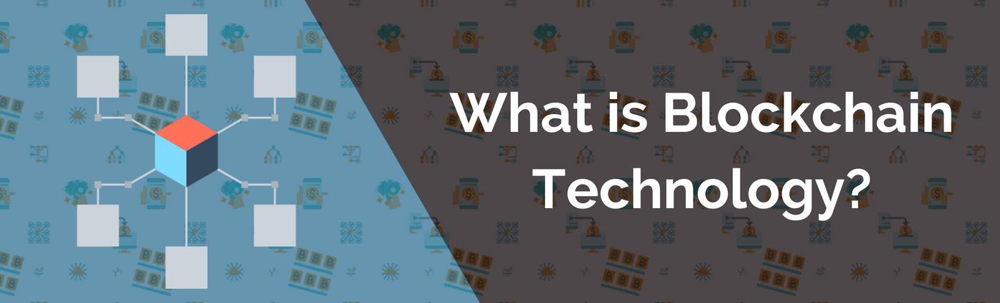
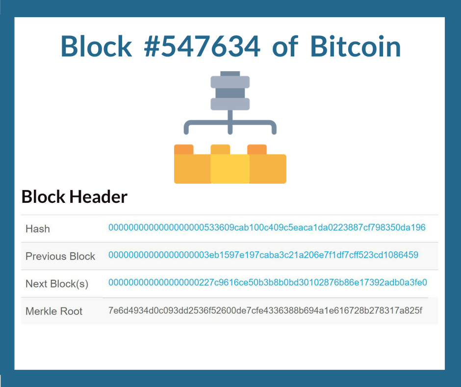
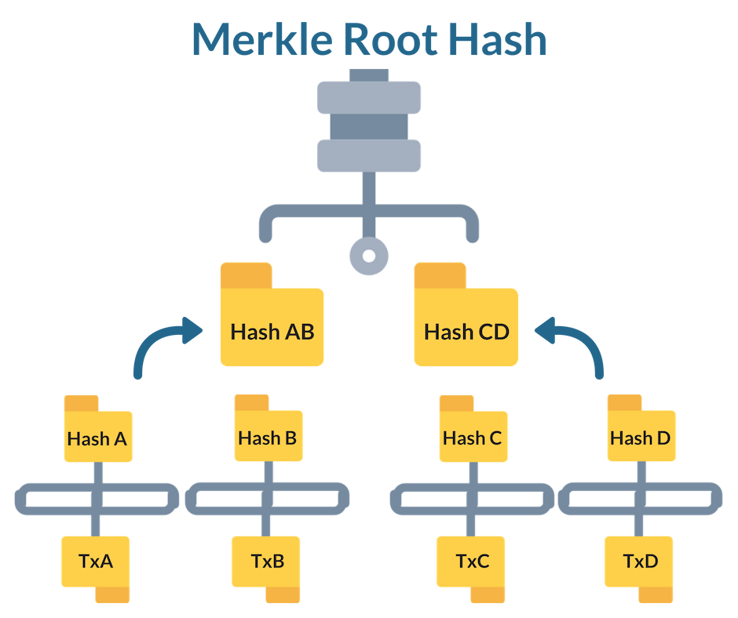

# Technical Intro to Blockchain

This module is going to be technically heavy. There are already too many oversimplified tutorials out there that gloss over important data structures and elements, and we are not going to contribute to that. Please feel free to visit our [support community](https://community.accrubit.com) where you can ask any questions if you are stuck or lost. 


### What this section covers

* Blockchain Basics
* Distributed P2P Networks
* Digital Ledgers: Traditional
* Byzantine Generals Problem
* Digital Ledgers: Blockchain
* Cryptographic Hashes
* Blockchain Mining
* Consensus Methodologies




Blockchain was first invented with the development of the cryptocurrency Bitcoin, which is a peer to peer digital currency and settlement network that enables individuals to store, retrieve, and transact anywhere in the world across any border without needing a 3rd party to facilitate the service. [\[1\]](https://bitcoin.org/bitcoin.pdf)  
  
It's important to note, that Bitcoin and blockchain are not synonymous with each other anymore. Blockchain is the underlying software design that enables Bitcoin to exist, but like any other software product there are many different variations on the market. [\[2\]](https://www.ibm.com/blogs/blockchain/2017/05/the-difference-between-bitcoin-and-blockchain-for-business/)  
  
Due to this, there are hundreds of definitions for blockchain circulating around the internet, most of which are inaccurate or over simplified. As a blockchain developer, the below definition is what you want to actually remember. [\[6\]](http://fortune.com/2017/12/07/satire-its-time-to-admit-no-one-knows-what-the-blockchain-is/)


### Blockchain Defined:

A blockchain is a chronologically sorted, distributed, digital ledger which contains an irreversible archive of transaction records that are stored and chained together in batches called blocks.



For those familiar with data structures, you could roughly describe a blockchain as a linked list of data containers holding Merkle hash trees of records. 

So now that we know what a blockchain is, we can begin breaking down some of the components in this definition. The first we will start with is the block.


### Blocks Defined:

A block is a data container which uses a Merkle tree data structure to store cryptographic links to it's underlying records using hashes. The following is a list of basic block components:

1. **Header**
   1. Parent Block's Hash
   2. Merkle Tree Root
   3. Block Hash
2. **Record**
   1. Transaction Origin
   2. Transaction Destination
   3. Transaction Data
3. **Consensus Data**
   1. Nonce
   2. Timestamp


A block header basically contains all of the metadata necessary for the blockchain and node participants to validate and append a block to the blockchain. The previous block's hash is used to create the current block's hash, which when appended to the blockchain creates a chronological chain of blocks starting from the genesis block. This is why it's called a blockchain.



The genesis block is the very first block in a blockchain, and since it does not have a previous block to build an identifier from, it is defined instead in the software itself during development. It contains parameters such as the mining difficulty, chain configuration, etc and is always considered block\[0\] much like an array.  You could look at it as the “settings” for your blockchain. 

For example, below is a JSON file for a genesis block configuration for an Ethereum based blockchain:



```javascript
{
  "config": {
      "chainId": 0,
      "homesteadBlock": 0,
      "eip155Block": 0,
      "eip158Block": 0
    },
  "alloc"      : {},
  "coinbase"   : "0x0000000000000000000000000000000000000000",
  "difficulty" : "0x10500",
  "extraData"  : "",
  "gasLimit"   : "0x2fefd8",
  "nonce"      : "0x000000000000032",
  "mixhash"    : "0x0000000000000000000000000000000000000000000000000000000000000000",
  "parentHash" : "0x0000000000000000000000000000000000000000000000000000000000000000",
  "timestamp"  : "0x00"
}
```



If you don't understand the above, don't worry. We will be covering the development side extensively in later modules. What's important right now is that you know the above file represents a genesis block, which is the first block in a blockchain, and contains the settings for how the blockchain will run.

Since we can visualize a blockchain in chronological order from the genesis block, we also have what is called the block height, which is simply the count from 0 \(Genesis\) to the last block appended to the chain. 

Next we have to talk about Merkle roots and Merkle trees, which are the basis for all data storage in a blockchain.


### Merkle Trees Defined:

A Merkle tree is typically a binary hash tree that is created by repeatedly hashing pairs of nodes, starting from the bottom of the tree, up until there is only one hash left. This last hash is called the Merkle Root and represents all of the data in the tree.


On a blockchain the data record being hashed is called a transaction. Depending on what your blockchain is for, the data in these transactions can vary greatly. With Bitcoin they contain cryptocurrency transfer amounts and wallet addresses, but in another blockchain it could be car transfers between two dealerships.



### So why use Merkle trees?

Since a Merkle root can represent a vast number of records, data can be reconstructed rapidly for fast access, and consensus protocols can quickly verify and accept that a block has integrity. This block integrity combined with the use of linking blocks with parent hashes, makes it so that not even a single transaction record can be modified without making the entire block, and subsequent blockchain invalid.

This is a pretty powerful combination that not only protects data, but allows quick searching and indexing. This is one of the key functions of blockchains as a peer to peer ledger, as they allow the possibility of light clients where only the block headers need to be downloaded, instead of every single transaction for every single block.

Blockchains also can use varying amounts of Merkle trees per block. For example:

* Bitcoin uses 1 Merkle tree for the storage of all transaction data.


* Ethereum uses 3 Merkle trees for:
  * Transactions
  * Transaction Receipts 
  * State


Now you may look at the above diagram and notice there is only two trees here. This is because the third tree is much more complicated in Ethereum and uses what is called a Patricia Tree to manage the state of the Ethereum blockchain. This is beyond the scope of this guide, but if you want to rack your brain around it, just head over to ethereum.org.


